# Prineet Worklog

[[_TOC_]]

# 2026-02-13 - Meeting Zhuchen & Project Proposal

This week marked our first meeting with our group TA, Zhuchen Shao. We told him the idea we had for our project and presented our initial block diagram. This was helpful for both him and us, since in building out our high-level block diagram we were able to better clarify to each other in the group what exactly we meant when we were pitching our idea to each other. 

He showed us how we can order our parts in the future and helped us understand more about what was expected of us. I also thought about the PCB and started to draw up plans for what we would want on it when that time would come.

# 2026-02-20 - PCB Schematic is Done

This week, I really worked on hard on making the PCB schematic for the project. I really wanted to make the early deadline of 2/20 to have our PCB reviewed by a TA. I also heard that extra credit was given to teams that were able to do that, but I wasn't able to make the deadline for that. That's ok though, since Supra and Srikar are starting to compile the order list that they want to give to Zhuchen for our first big order of parts. Since I worked on the Schematic, I'll probably let Supra and Srikar take care of the actual layout while I take over for them for ordering the parts and getting ready for our first big lab session. 

I was able to present my schematic to Zhuchen to our group meeting, he seemed impressed and offered me good feedback on what I had done.

This was the processing unit I designed:

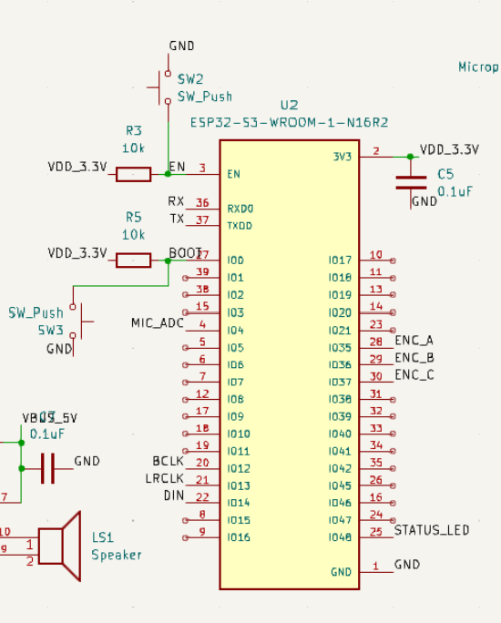

Here's the microphone/input system:

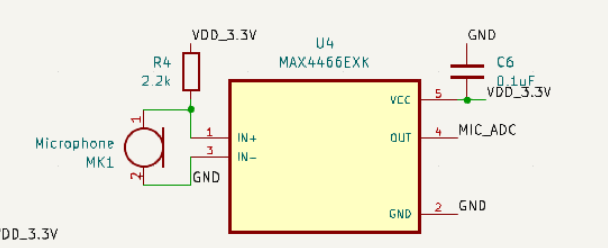

Finally, here's the speaker schematic:

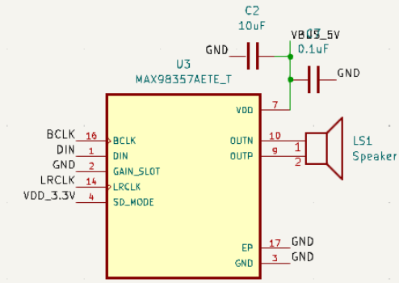

# 2026-02-27 - The PCB is Finished

Our group decided to make a couple of core changes to our design. Firstly, we changed to using the Alps Switch encoder for our design. We also changed how we power our whole system. We used to do it with USB-C, that's what I put in the schematic. Howewver, we changed to Micro USB, as it should be easier for us to use and power. The tradeoff with this is that obtaining a Micro USB cable is harder, I know I certainly don't have one. 

Srikar also worked hard this week on the PCB layout. He took the PCB schematic that I made last week, made the proper tweaks to change what I outlined above, and then made the layout for the PCB. 

Here is the finalized PCB layout:

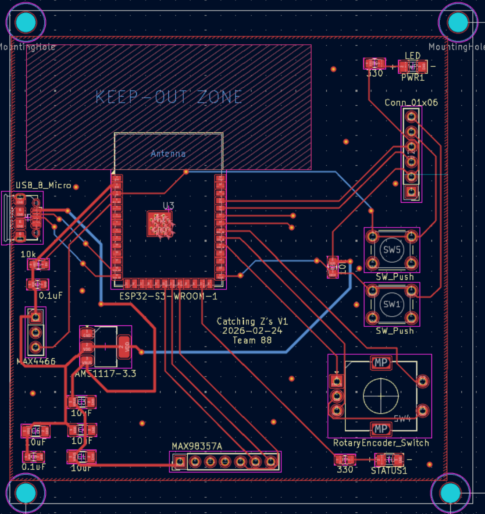

Me and Supra also worked on updating our order list to account for the changes that we had made to what we need for our PCB. 

I like the current pace of our project. Because we're doing a good job of keeping each other updated, it's made it easier on all of us as it lessens the tension that is associated with having partners during a group project.

Additionally, our design doc was due today. A lot of what we want to accomoplish is in the design doc. I'll attach the relevant portions here.

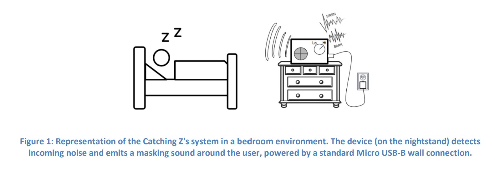

To trigger a masking noise, the noise event should be at least 10 dB higher than the baseline. So, the amplitude ratio can be found by:

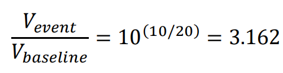

This is what we've estimated our project to cost (this is pretty interesting to me, I wonder how much it would be if we bought the components for this project wholesale, like if we were doing mass manufacturing for this system).

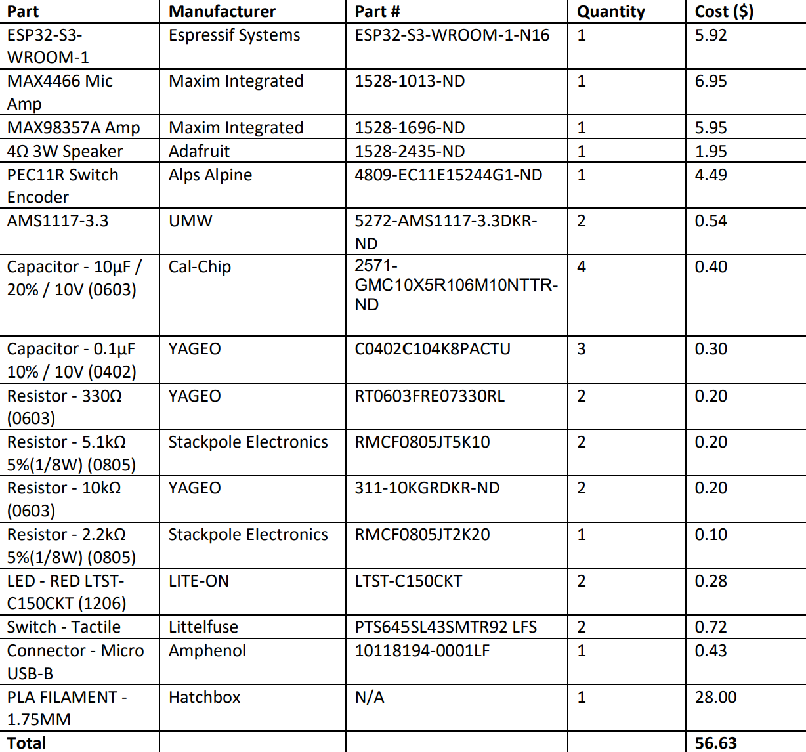

# 2026-03-06 - Prototyping

During our design review with Professor Gruev, he suggested that we make our project more complicated. His main point here is that we were not doing anything novel, which is a fair criticism of our project. We should aim higher, and I believe in our group enough to accomplish it. One of the things that he mentioned was to add spectral analysis to our project. 

With this spectral analysis, we might be able to have the output frequency match the input frequency, allowing for the ability to mask different kind of noises adaptively to what is happening in the background.  

We also started to work on our breadboard. We had to use the ESP32 dev board since our STM32 one didn't work. We added a microphone to get input and a LED array to act as like a volume display to show how loud the input sound was. 

I hope that this is enough progress for our breadboard demo next week. It has been difficult for us since we are still waiting to get some components to start actual dev work, so we had to do the best we could with what we had. I think that what we have right now is sufficient to show that we have a plan with the input audio that comes through the microphone.

# 2026-03-13 - Last Day Before Spring Break

We found some breakout boards that we got permission to use on the final project. This would make the layout of the PCB so much cleaner and smaller, so it was a no brainer for us to use it. Here are the two breakout boards that we found:

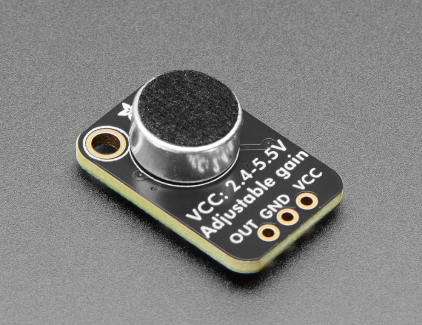

Link: https://www.adafruit.com/product/1063?srsltid=AfmBOoq1_ZeF1upSoV16VT7XkKl8Ah0HNs23jcOlRoFMnywjewPwBUsj 

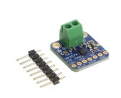

Link: https://www.digikey.com/en/products/detail/adafruit-industries-llc/3006/6058477

We had to update our PCB layout to accomodate for this change. Here is the updated layout:

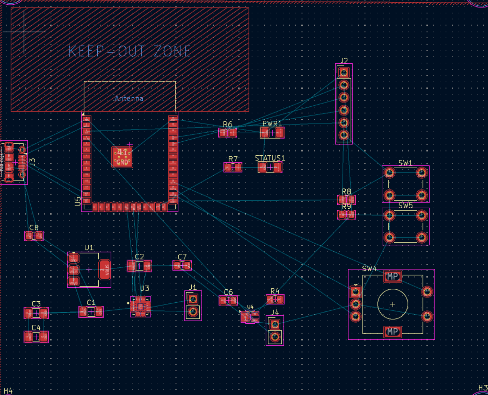

This is what the current state of the breadboard is, with our current hardware on it for the input noise volume sensing:

For our breadboard demo, we were able to integrate the adaptive baseline code. First, the room volume is sampled 100 times, which corresponds to 20 ms. For the final system, we will probably have it sample for a couple of seconds to establish a fimer and prolonged baseline. The current room noise was also sampled as we moved, slowly getting faded into the baseline according to how we tuned an adaptive baseline constant, which we can call alpha. If alpha is high, the current room value plays a big part in updating the moving baseline. If it is low, the change to the moving baseline is more subtle.

The LED is there to simulate the speaker. When the LED turns on, it is as if the threshold has been crossed (which we know due to the tolerance analysis which I included above) and the speaker (in this case, the LED) should be turned on. 

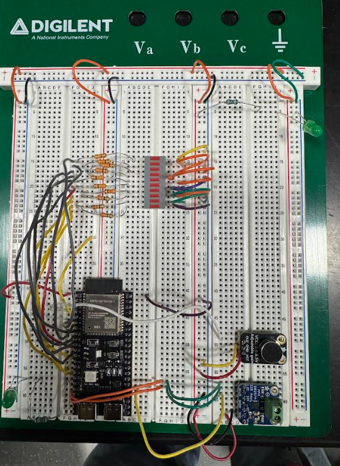

