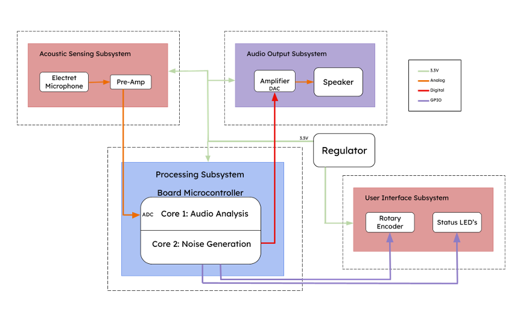
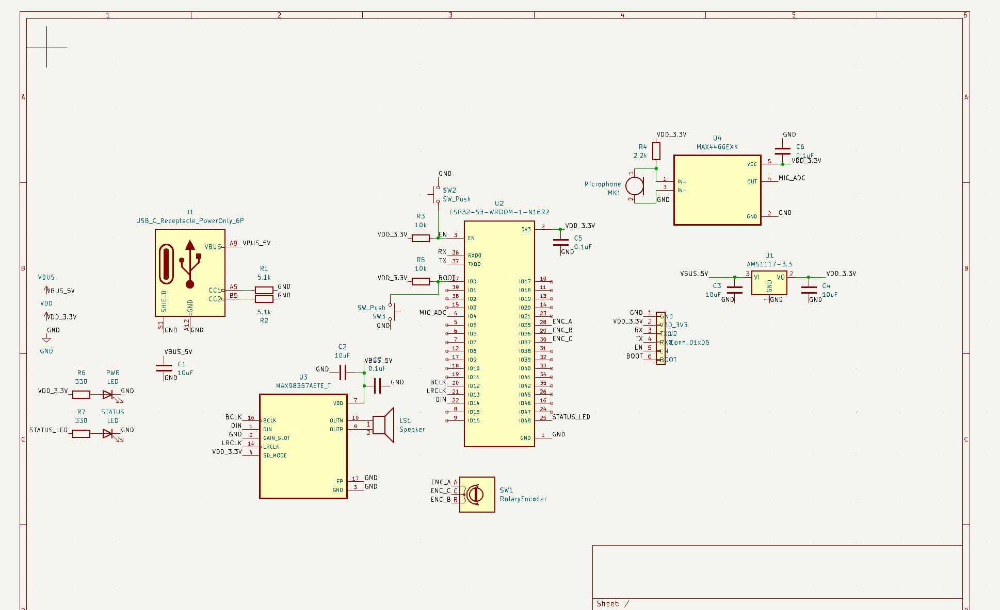

# Suprathik Worklog

[[_TOC_]]

# 2026-02-10 - Discussion with TA
This was our first meeting with our TA Zhuchen Shao. We discussed our idea and walked through our initial block diagram with the TA. He then provided some direction on how to go about ordering parts and told us about some other project logistics.

# 2026-02-13 - Finishing project proposal
Throughout the week our group worked on our project proposal. With some research I was able to finalize our parts list for our project. We also finalized our block diagram.

This is our block diagram.

I found the MAX4466 Mic Amp which comes with both a microphone and ADC on the board. It has adjustable gain and is low cost making it convenient for us to use.

[link](https://www.digikey.com/en/products/detail/adafruit-industries-llc/1063/4990762)

Then for our DAC and speaker amplifier I found the MAX98357A

These parts will be combined with an ESP32, a generic speaker, and some other small parts to create our final prodcut.

# 2026-02-19 - Second Discussion with TA and Schematic
This week we created our schematic to begin our PCB design and reviewed it with our TA. We then started working on the order form for our parts.

Our schematic:
