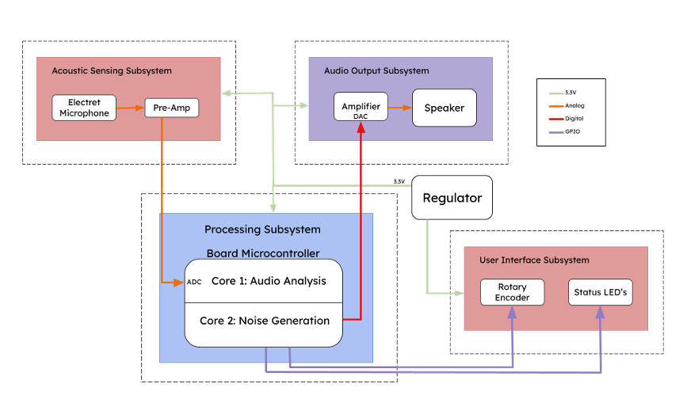
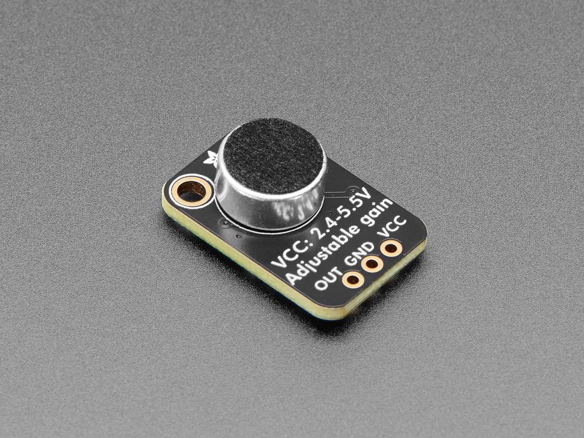
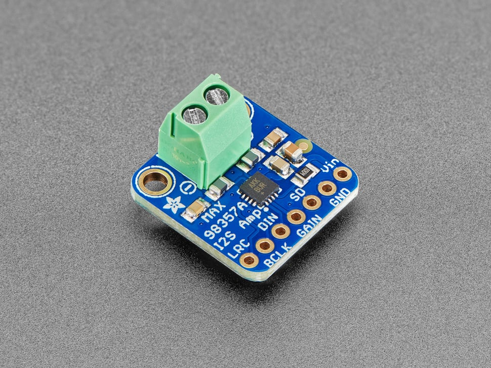
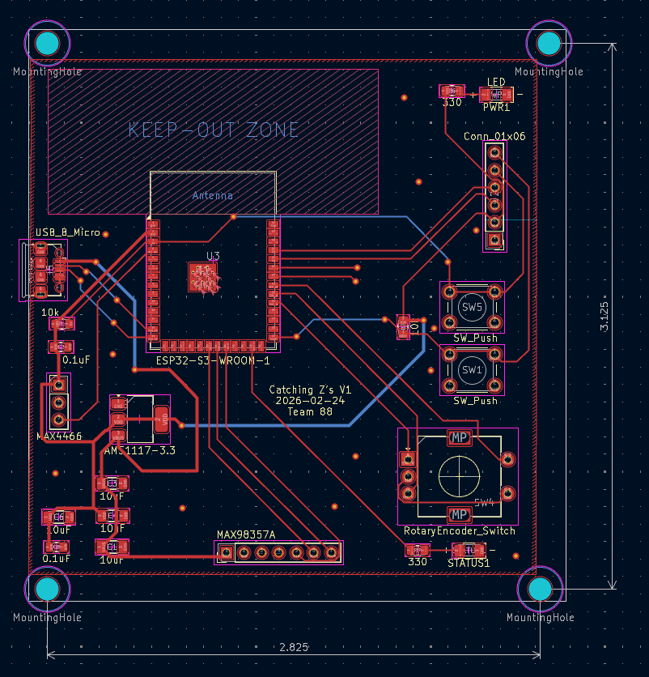

# Srikar Worklog

[[_TOC_]]

# 2026-02-10 - Discussion with TA
This was our first meeting with our TA Zhuchen Shao. We discussed our idea and walked through our initial block diagram with the TA. He then provided some direction on how to go about ordering parts and told us about some other project logistics.

# 2026-02-13 - Finishing project proposal
Throughout the week our group worked on our project proposal. With some research I was able to finalize our parts list for our project. We also finalized our block diagram.

This is our block diagram.

I found the MAX4466 Mic Amp which comes with both a microphone and ADC on the board. It has adjustable gain and is low cost making it convenient for us to use.

[link](https://www.digikey.com/en/products/detail/adafruit-industries-llc/1063/4990762)

Then for our DAC and speaker amplifier I found the MAX98357A

These parts will be combined with an ESP32, a generic speaker, and some other small parts to create our final prodcut.

# 2026-02-19 - Second Discussion with TA and Schematic
This week we created our schematic to begin our PCB design and reviewed it with our TA. We then started working on the order form for our parts.

Our schematic:

# 2026-02-25 - Finalizing PCB Design
I updated our schematic to match the parts we ordered. I then moved onto routing the PCB. I placed the components such that the user interface is on the front of the pcb while power would be on the back. I had to redo the placement for the most optimal routing. Eventually I was able to get a well organized PCB and I sent it to the TA for ordering. 

This is the final layout:

# 2026-03-08 - Working Mic Breadboard
We began work on our breadboard. We started by using the STM32 dev board, but our board was faulty and never connected to our laptops. Next I tried using the Espressif ESP32 dev board and was able to succesfully connect to it. I added a microphone, led array, and switch to the circuit. Then, I got a simple program working that turns on an led when the switch is clicked and outputs the microphones reading to the serial monitor.

# 2026-03-09 - Improved Audio Detection and Display
Since our speaker has not arrived yet, we decided to make a volume bar that displays the relative volume of sound compared to a room's baseline noise. I started by creating a program that turns on 3 LEDs based on the Microphones raw reading. It was highly sensitive and I adjusted the mic with a gain potentiometer. Next we added a 10 LED array to the circuit. I expanded the program to use peak-to-peak amplitude to remove the mic's DC offset. Then I added a smoothing filter that takes an EMA, giving new values only 15% weight. This acts as a low pass filter. Finally, the LEDs turn off slowly to avoid rapid flickering on the way down as well.

Next, the program was expanded to have a moving baseline. It samples the room volume on startup, taking 100 samples for 20 ms. This becomes the baseline volume that is used to compare the mic reading to. This baseline slowly adapts as room noise changes, only updating if sound increases slowly, therefore not updating on sound spikes. Next, beacuse human hearing and decibel scale is logarithmic, the LED bar was updated to display on a logarithmic scale.

Finally, as a replacement for the speaker, we added an LED that indicates if the speaker would be on. For this we used RMS instead of peak to peak, and triggered the LED if the decibel value is 10 dB over baseline. RMS or Root Mean Squared is a more accurate to how humans percieve noise. This code is almost the same as the previous, but is used to trigger the speaker LED.

