# Srikar Worklog

[[_TOC_]]

# 2026-02-10 - Discussion with TA
This was our first meeting with our TA Zhuchen Shao. We discussed our idea and walked through our initial block diagram with the TA. He then provided some direction on how to go about ordering parts and told us about some other project logistics.

# 2026-02-13 - Finishing project proposal
Throughout the week our group worked on our project proposal. With some research I was able to finalize our parts list for our project. We also finalized our block diagram.

This is our block diagram.
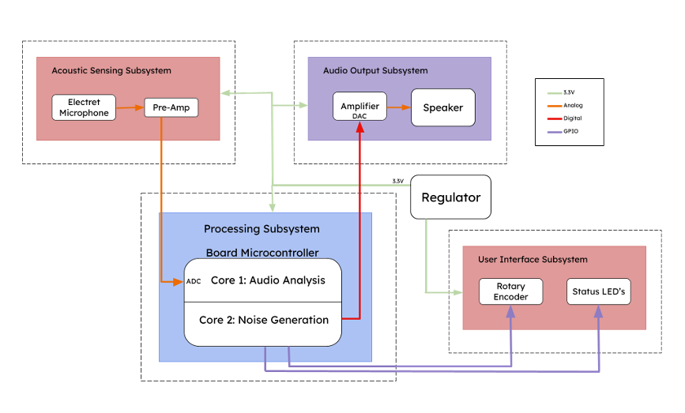

I found the MAX4466 Mic Amp which comes with both a microphone and ADC on the board. It has adjustable gain and is low cost making it convenient for us to use.
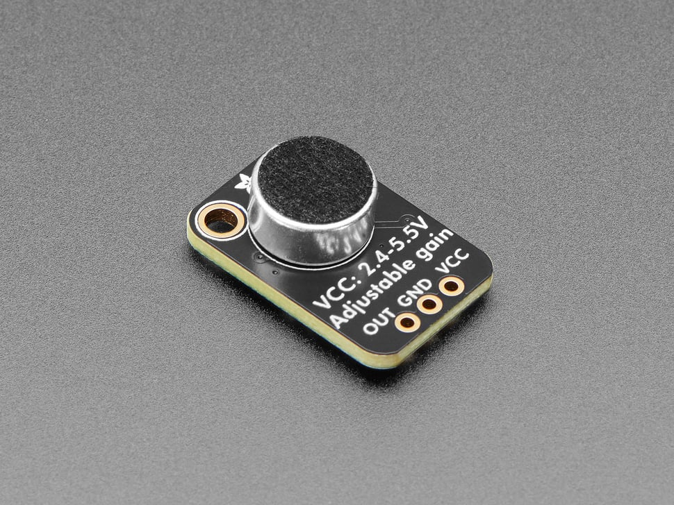
[link](https://www.digikey.com/en/products/detail/adafruit-industries-llc/1063/4990762)

Then for our DAC and speaker amplifier I found the MAX98357A
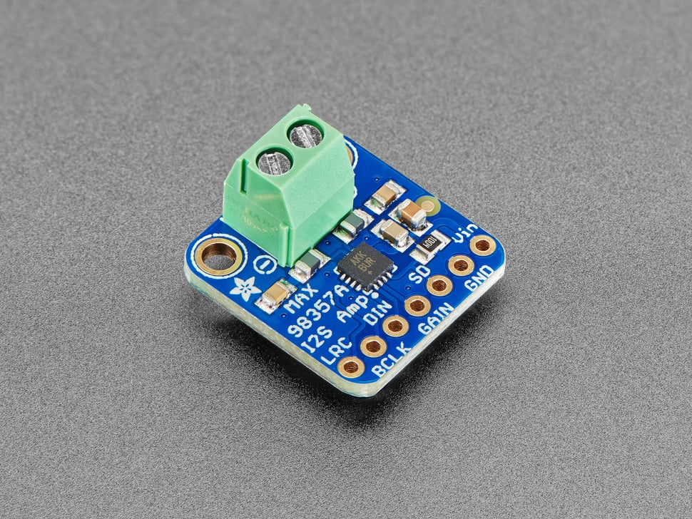

These parts will be combined with an ESP32, a generic speaker, and some other small parts to create our final prodcut.

# 2026-02-19 - Second Discussion with TA and Schematic
This week we created our schematic to begin our PCB design and reviewed it with our TA. We then started working on the order form for our parts.

Our schematic:
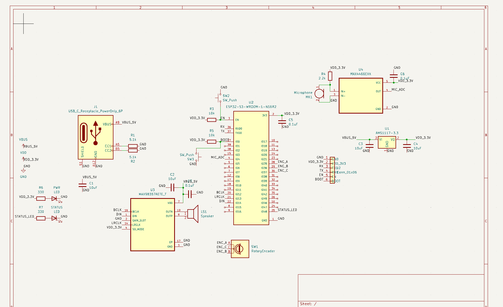

# 2026-02-25 - Finalizing PCB Design
I updated our schematic to match the parts we ordered. I then moved onto routing the PCB. I placed the components such that the user interface is on the front of the pcb while power would be on the back. I had to redo the placement for the most optimal routing. Eventually I was able to get a well organized PCB and I sent it to the TA for ordering. 

This is the final layout:
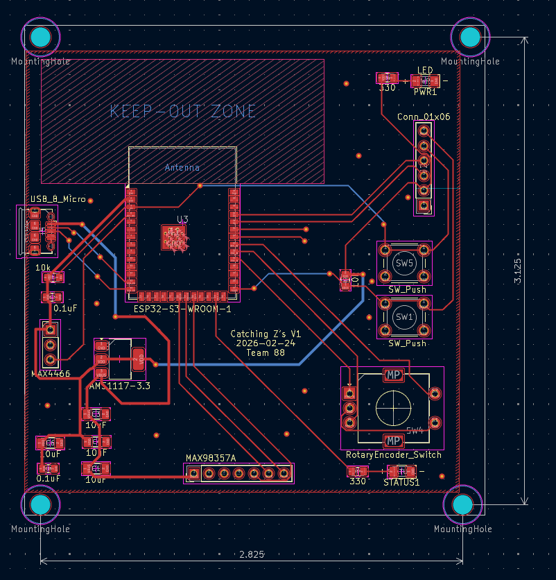

# 2026-03-08 - Working Mic Breadboard
We began work on our breadboard. We started by using the STM32 dev board, but our board was faulty and never connected to our laptops. Next I tried using the Espressif ESP32 dev board and was able to succesfully connect to it. I added a microphone, led array, and switch to the circuit. Then, I got a simple program working that turns on an led when the switch is clicked and outputs the microphones reading to the serial monitor.

# 2026-03-09 - Improved Audio Detection and Display
Since our speaker has not arrived yet, we decided to make a volume bar that displays the relative volume of sound compared to a room's baseline noise. I started by creating a program that turns on 3 LEDs based on the Microphones raw reading. It was highly sensitive and I adjusted the mic with a gain potentiometer. Next we added a 10 LED array to the circuit. I expanded the program to use peak-to-peak amplitude to remove the mic's DC offset. Then I added a smoothing filter that takes an EMA, giving new values only 15% weight. This acts as a low pass filter. Finally, the LEDs turn off slowly to avoid rapid flickering on the way down as well.

Next, the program was expanded to have a moving baseline. It samples the room volume on startup, taking 100 samples for 20 ms. This becomes the baseline volume that is used to compare the mic reading to. This baseline slowly adapts as room noise changes, only updating if sound increases slowly, therefore not updating on sound spikes. Next, beacuse human hearing and decibel scale is logarithmic, the LED bar was updated to display on a logarithmic scale.

Finally, as a replacement for the speaker, we added an LED that indicates if the speaker would be on. For this we used RMS instead of peak to peak, and triggered the LED if the decibel value is 10 dB over baseline. RMS or Root Mean Squared is a more accurate to how humans percieve noise. This code is almost the same as the previous, but is used to trigger the speaker LED.

# 2026-03-23 - Adding Speaker
I added the speaker to our breadboard to begin testing output. The speaker generated noise corectly, and I began to implement our noise masking algorithm.

# 2026-03-25 - Soldering Parts to PCB
We began soldering all our parts to the PCB. I checked that all the soldered parts were correctly electrically connected. However, we noticed the footprints of some of our parts were incorrect so we are reordering some parts. I also added a header to the pcb for testing parts on extra pins on the esp if needed.

# 2026-03-26 - New PCB order and working on Individual Progress Report
I worked on a final PCB version that makes debugging easier. This was brought about after we had issues with our original PCB that were hard to diagnose. In addition I have been working on my individual progress report.

# 2026-04-02 - Soldering parts to PCB
After receiving the new parts with the correct footprints we soldered them onto our PCB. We noticed unstable voltage on the enable pin and thought our decoupling capacitor was causing issues. After desoldering it I observed that the voltage stabilized but it was stuck at 2.5v instead of the required 3.3v. I was unable to diagnose the specific issue, but noticed that our PCB had an issue where not every part that was supposed to be grounded were connected to each other on the ground plane. This likely caused issues with the voltage.

# 2026-04-03 - Soldering Parts to new PCB
After receiving the new parts with the correct footprints I soldered them onto our newest PCB. After doing do so our issues from the previous PCB disappeared and I was able to succesfully connect to the ESP32 and upload code to it.

# 2026-04-06 - Working on Software and Enclosure
We started the 3D print for our enclosure while working on the noise masking software. We already had code that played white noise if the room noise crossed a baseline threshold. We decided to upgrade this with spectral analysis so that the speaker would play white, pink, or brown noise depending on the input frequency. Brown noise is played if the input is less than 300Hz, pink noise between 300Hz and 1500Hz, and white noise at greater than 1500Hz. Whenever noise is played the software smoothly transitions into the required volume and noise type to prevent disturbance. However, we were having issues where the generated audio was choppy, or there were detection issues. After some research we realized that running everything on a single ESP32 core causes detection and audio generation to conflict. So to fix this, we seperated the tasks into one core each. Finally we added volume control with an encoder.

The noise is built with a continuous pink-noise bed as always part of the masker, then a softer accent layer is added based on the selected white, pink, or brown noise color and gently shaped toward the detected disturbance band with a broad band-pass filter. The final sound is softened again with a low-pass stage, while gain, volume, and noise-color changes are all smoothed over time so transitions do not jump suddenly. 

# 2026-4-15 - Continuing Software Improvement and Redesigning Enclosure
After some initial testing we decided that doing bucketed spectral analysis was not variable enough for producing an effective masking noise. I updated the code to capture a 128-sample frame from the mic at 16 kHz, remove the DC offset, compute loudness metrics, and then call an analyze function. Here, the frame is windowed with a Hann window, run through the FFT, and then only bins between 80 Hz and 4500 Hz are considered. The code smooths each bin’s magnitude over time, sums a small neighborhood around each bin, and finds both the strongest and second-strongest peaks. It then computes a weighted center frequency for the dominant peak and a second frequency for the runner-up, so the detector ends up with dominantFreqHz, dominantPower, secondaryFreqHz, and secondaryPower.

This information is used to figure out what kind of masker should be produced and is also used to decide when to retarget masking to a new noise. The code checks whether the current frame is loud enough to matter, whether the new dominant peak is different enough from the current target, and whether it is stronger than both the previous target and the runner-up peak. This is when it decides to switch the masking noise.

We also decided that to ensure that the masking noise fills the target area more effectively it would be better to use 2 speakers. This dual speaker design required us to start redesigning our enclosure.

# 2026-4-21 - Testing New Enclosure

I soldered the additional speaker to the pcb, connecting it in series with the existing speaker. By connecting it in series it avoids overdriving the speaker voltage, however it reduces voume. We also printed a new pentagonal enclosure that is designed to increase the area covered by the masking noise. We put the parts in the enclosure making a few modifications to make everything fit in. I then retuned the software to bring the speakers back to the desired volume. At this point I noticed the output was very choppy and the output sound was pulsing too much. To fix this we switched to a multiband approach. 

The multiband approach uses the FFT to split the incoming microphone signal into several frequency regions instead of chasing one exact frequency. The code samples the mic at 16 kHz, runs an FFT on 256 samples, then measures energy in six bands: 80-180, 180-360, 360-720, 720-1400, 1400-2800, and 2800-5000 Hz. The band with more energy receives a stronger masking target, but the targets are smoothed over time so the output does not jump or pulse. The speaker output is generated from a blend of white, pink, and brown noise, passed through matching band-pass filters, then mixed according to the FFT band strengths. This means the device is still adaptive, but it adapts by shaping noise across broader frequency bands rather than trying to reproduce or cancel a single precise tone. After this we noticed a much more optimal output, but we also noticed that after putting the device in the enclosure it was hearing itself and trying to mask it's own output causing an infinite sound loop.

# 2026-4-22 - Adaptive Echo Cancellation

To combat the infinite cancellation loop from microphone hearing the speaker output I decided to implement adaptive echo cancellation, a smart algorithm designed to cancel the speakers output. Adaptive echo cancellation works by treating the mic input as mic = real room noise + speaker leakage. Since the code knows what it is sending to the speaker, it saves the output samples in a reference buffer, then compares each new mic frame against delayed versions of that speaker signal. It tests delays from 32 to 160 samples, which at 16 kHz is about 2-10 ms, and uses correlation to find which delayed copy best matches the mic signal. If the correlation is high enough, it estimates the leakage gain as approximately gain = mic·ref / ref·ref, then subtracts the scaled reference from the mic: cleaned mic = mic - gain * ref * ECHO_SUBTRACT_MIX. The FFT then analyzes this cleaned signal instead of the raw mic signal, which helps prevent the system from responding to its own speaker output. This helped at lower volumes but was not as effective when the output volume was loud enough for loud noise masking.

# 2025-4-26 - Feedback Loop Cancellation and Overnight Test

Listening closely to the device, I noticed that the acoustics inside the enclosure were slightly different than the actual output, which meant that the noise that the microphone was trying to ignore was different than the one it was actually hearing. To combat this I repurposed the second microphone input we had planned on using as an internal microphone. We planned on using this to listen to the actual speaker output and use that to determine whether the device was activating itself. 

The main mic hears the room plus possible speaker feedback, while the reference mic is positioned to hear the device’s own speaker/enclosure output more strongly than outside disturbances. For each captured frame, the code compares the main mic and reference mic using correlation, roughly checking whether the two signals have the same shape over time. If reference correlation is high and the reference mic level is strong enough relative to the main mic, the code decides the sound is likely self-feedback rather than a real external disturbance. It can then subtract a scaled version of the reference mic from the main mic signal, using a gain estimate like gain = main·ref / ref·ref, and it can also suppress or release masking when repeated feedback frames are detected. Simply put, if both mics hear the same speaker-like signal and the reference mic hears it strongly, the device treats it as its own output and stops chasing it. At the same time we added serial plotting to gain deeper insight into the activation pattern of the device.

This fixed the feedback loop in a quiet environment and it was finally ready for the device to be tested overnight. To do this I added an overnight logging mode in the code, that outputs serial output with some device data every minute. I then wrote a python script to capture this output and log it in a csv file with timestamps. 

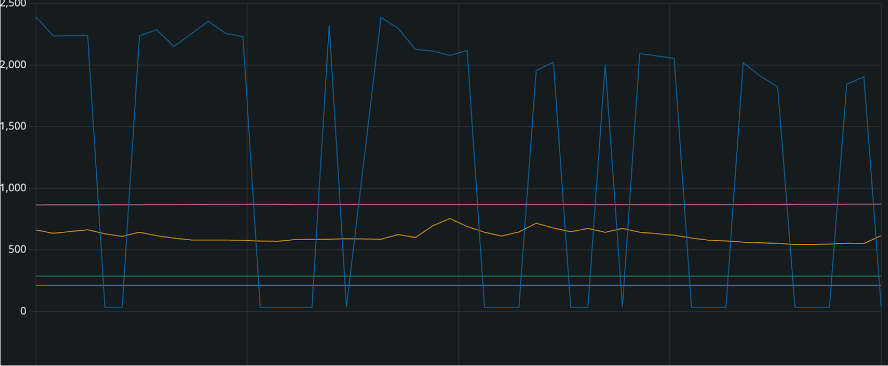

# 2026-4-27 - Python Simulation and Enclosure Improvement

The overnight test completed in the morning. After checking the log files, which I attached in the code section of the notebook, I noticed that the device did not activate overnight despite me hearing some disturbances. I realized that the threshold for activation was too high, so I retuned the device to be more sensitive. This brought back the feedback loop in some cases. We realized the device lid was rattling which may cause more acoustic disturbance, so we added a seal around the lid to avoid vibration. We then added foam inside the enclosure and around the microphone to isolate it from the speakers. After making these two changes the feedback loop completely stopped. 

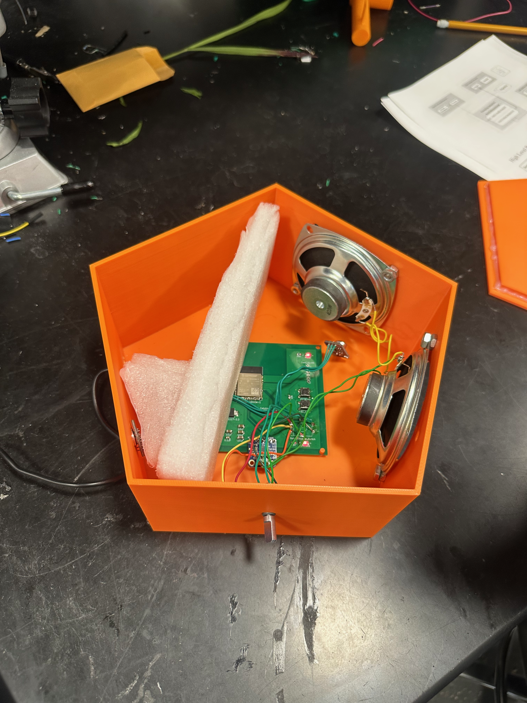

We then created a python simulation to showcase the effectiveness of our algorithm. It creates a synthetic “room noise plus disturbances” signal containing a low thump around 145 Hz, a tonal disturbance around 820 Hz, and a higher-frequency broadband burst around 2500 Hz, then runs a simplified version of the Arduino algorithm on it. It splits the signal into short FFT frames using FS = 16 kHz, FRAME = 256, and HOP = 128, measures power in the same six frequency bands, creates smoothed band targets, and generates shaped white/pink/brown masking noise focused toward the detected bands. It then saves plots showing the input disturbance and masking output over time, the adaptive trigger threshold, the detected input frequency versus output focus frequency, before/after spectrograms, and the band-target weights. It also calculates how much less prominent the 820 Hz tone becomes after masking, in dB, as a simple numerical demonstration of masking effectiveness.

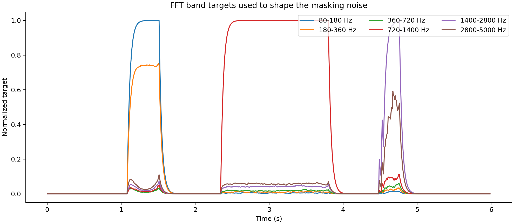
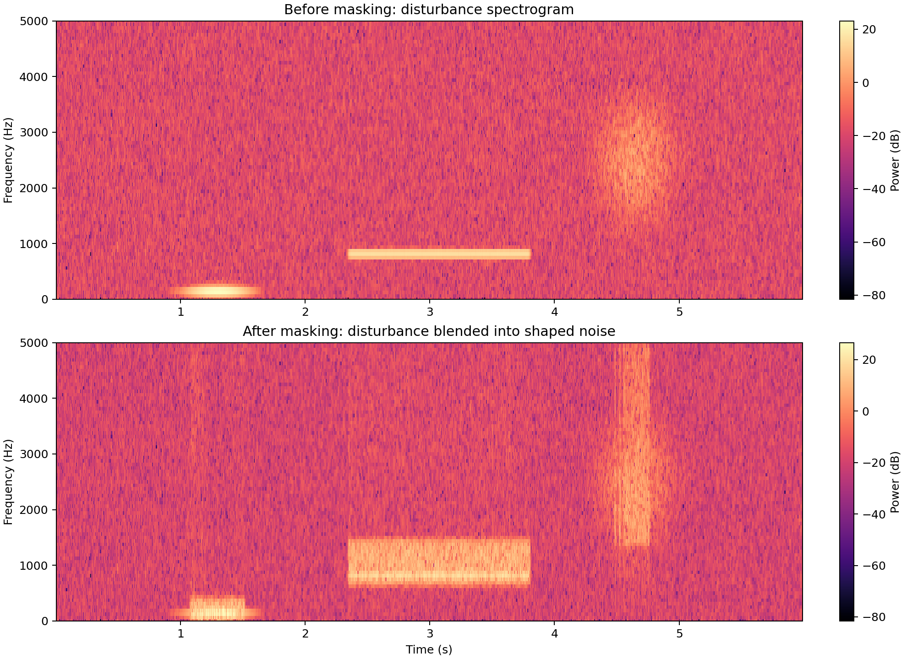
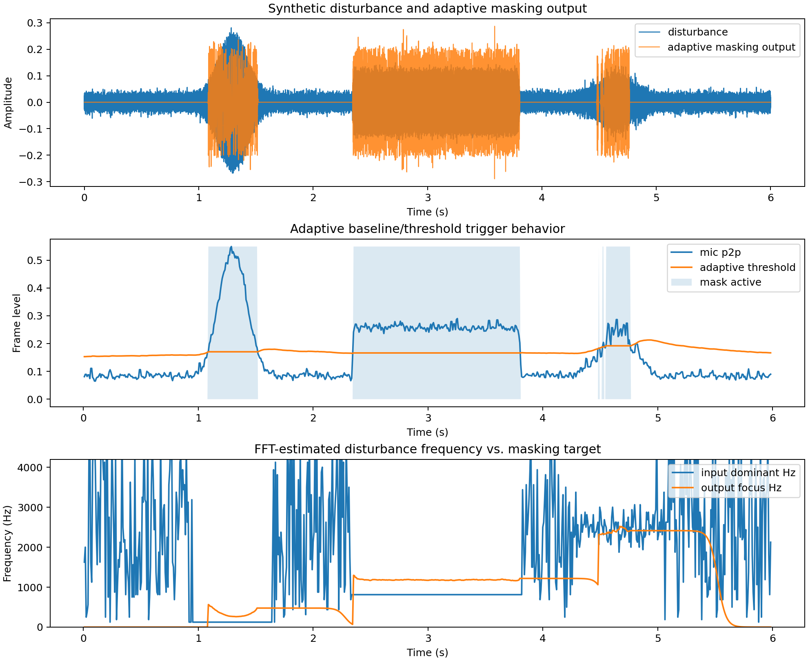

# 2026-4-28 - Final Calibration Changes

Testing the device in a loud and bursty noise environment made us realize that the device had trouble differentiating the loud background noise from actual disturbances. Looking into the issue we noticed that the devices baseline was not adjusting to the loud environment properly, taking too long and ignoring non distrubing sound bursts in the baseline adjustment function. To fix this we added a 15 second calibration on device startup, allowing the baseline to properly reflect the rooms noise level before activating sound masking. This fixed device behavior in noisy environments.

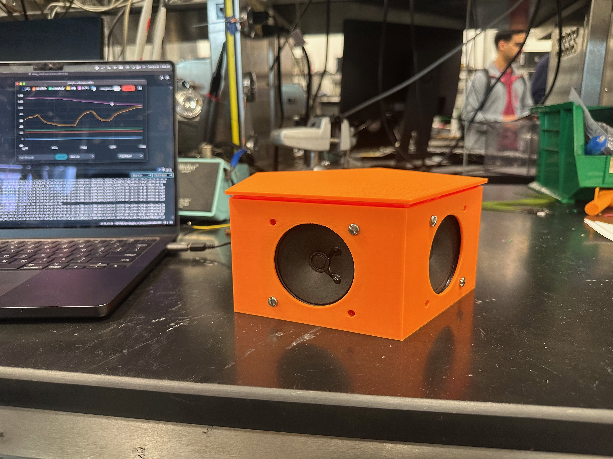