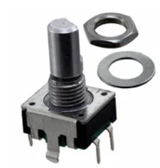
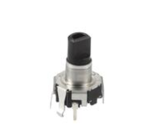

# Suprathik Worklog

[[_TOC_]]

# 2026-02-13 - Discussion TA Zhuchen Shao

This week we first met with our group TA to discuss the overall direction of our project. After building a visual understanding of how the project's subsystems would come together through a block diagram we then finalized logistics on how parts would be ordered and future meeting times and expectations. Later in the week I worked on finalizing the proposal including further ideating on the form factor of the product and deciding the exact sensors and parts we would be using. 

# 2021-02-20 - Schematic Design and Parts Updates

To start this week, our group began developing the schematic for our PCB in KiCad and successfully laid out the components for review during our mentor meeting. After planning part of the PCB design, I worked on preparing an order form for the parts available from the E-Shop.

However, some changes arose while selecting footprints for the schematic components and discussing the rotary encoder we planned to use. We considered adding additional functionality by using a push-button rotary encoder to enable a potential mute feature. As a result, we are currently deciding between a standard rotary encoder for simplicity:

[link](https://www.digikey.com/en/products/detail/bourns-inc/PEC11R-4215F-S0024/4499665)

and a push-button encoder for added functionality:

[link](https://www.digikey.com/en/products/detail/alps-alpine/EC12D1564402/21721641)

We are also deabting switching from the Bourns model proposed earlier to an Alps encoder to better match the available KiCad footprints but will be looking for libraries that include our desired footprints.

  
