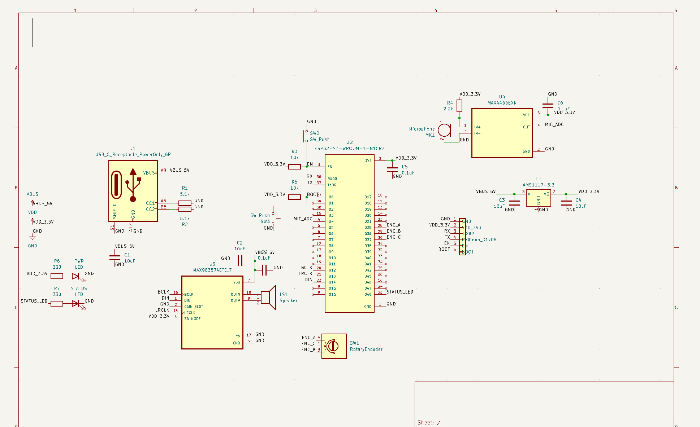
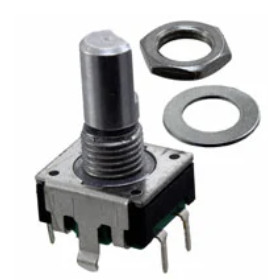
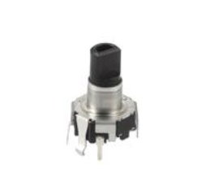
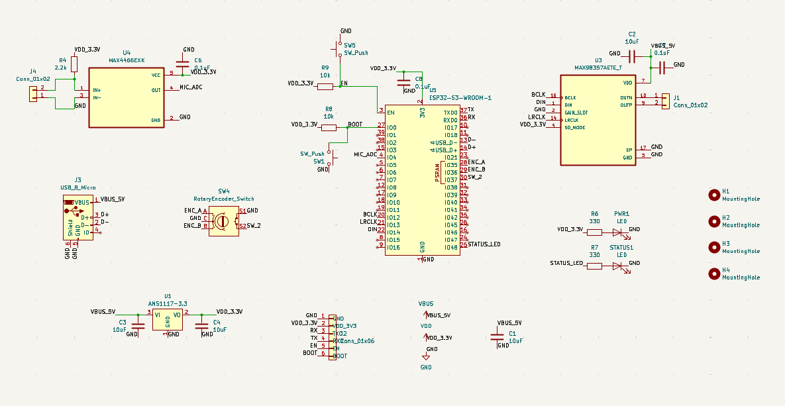
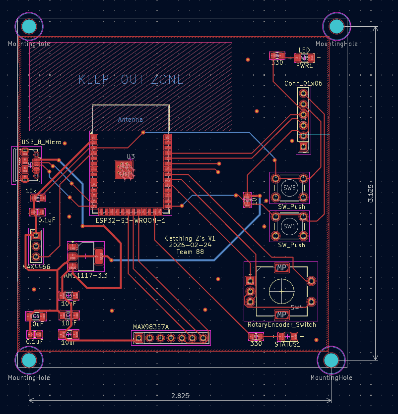
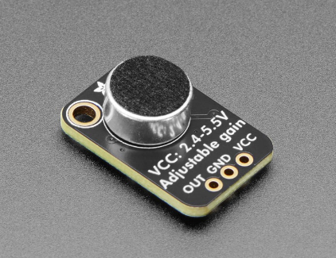
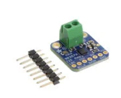
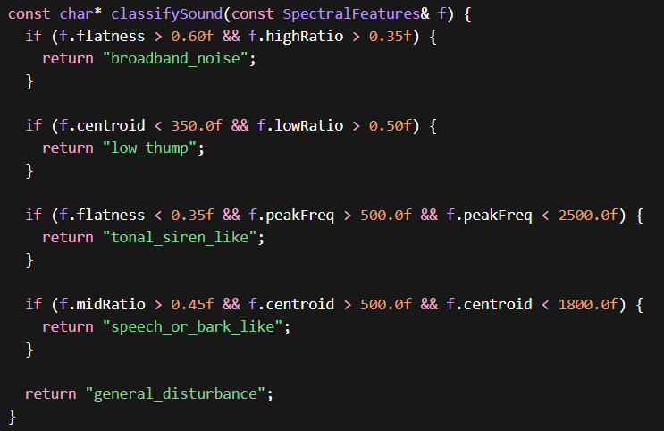
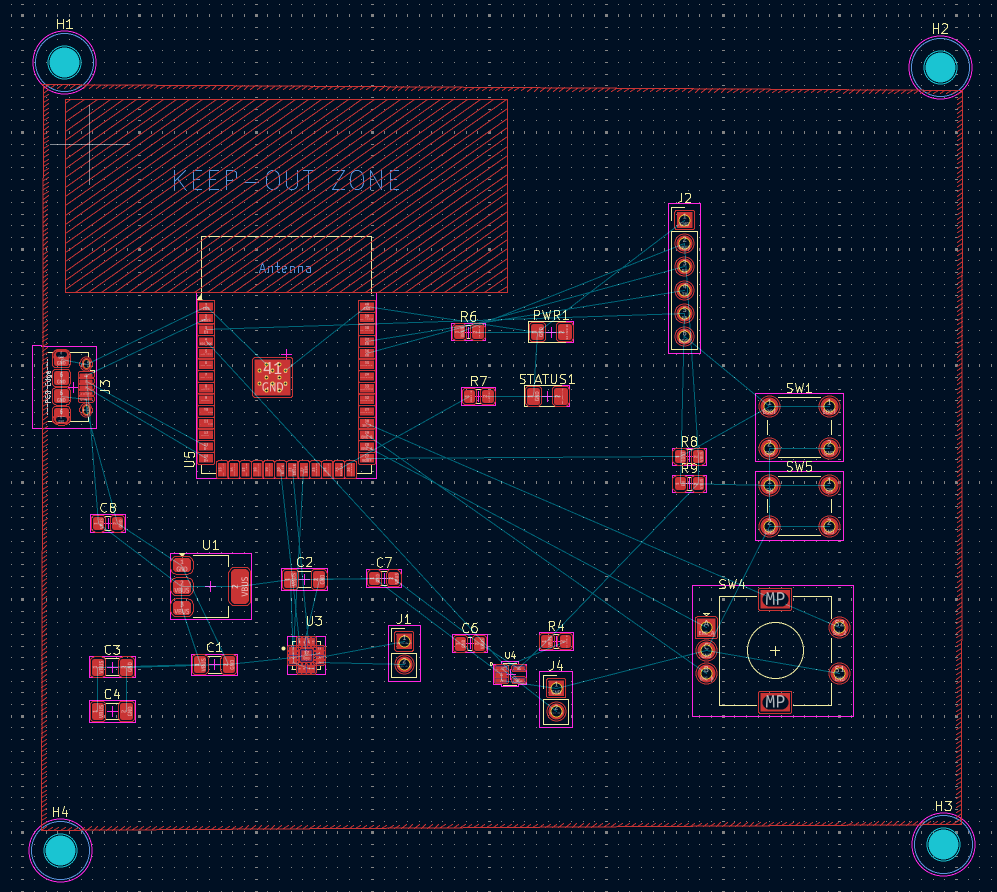

# Suprathik Worklog

[[_TOC_]]

# 2026-02-13 - Discussion with TA Zhuchen Shao

This week we first met with our group TA to discuss the overall direction of our project. After building a visual understanding of how the project's subsystems would come together through a block diagram we then finalized logistics on how parts would be ordered and future meeting times and expectations. Later in the week I worked on finalizing the proposal including further ideating on the form factor of the product and deciding the exact sensors and parts we would be using. 

# 2026-02-20 - Schematic Design and Parts Updates

To start this week, our group began developing the schematic for our PCB in KiCad and successfully laid out the components for review during our mentor meeting. After planning part of the PCB design, I worked on preparing an order form for the parts available from the E-Shop.

However, some changes arose while selecting footprints for the schematic components and discussing the rotary encoder we planned to use. We considered adding additional functionality by using a push-button rotary encoder to enable a potential mute feature. As a result, we are currently deciding between a standard rotary encoder for simplicity:

[link](https://www.digikey.com/en/products/detail/bourns-inc/PEC11R-4215F-S0024/4499665)

and a push-button encoder for added functionality:

[link](https://www.digikey.com/en/products/detail/alps-alpine/EC12D1564402/21721641)

We are also deabting switching from the Bourns model proposed earlier to an Alps encoder to better match the available KiCad footprints but will be looking for libraries that include our desired footprints.

# 2026-02-27 - Finalizing PCB Layout and Components

Picking up from last week we decided to switch to using the Alps Switch encoder for our design. After further discussion we also decided to switch from using USB-C to power the device and interface with our micrcontroller to Micro USB. We plan to use this for atleast the first iteration of our PCB as it is easier to hand solder and reduces the complexity for us slightly. After these changes we updated the schematic accordingly. 

We then focused on designing the layout of the PCB following similar principles to the CAD assignment and submitted our gerber files after running a DRC and using JLC's DFM verification tool. 

Finally for ease of testing with development boards we also found breakout boards that implement a lot of the circuitry needed for our audio sensing and audio output subsystems. 

[link](https://www.adafruit.com/product/1063?srsltid=AfmBOoq1_ZeF1upSoV16VT7XkKl8Ah0HNs23jcOlRoFMnywjewPwBUsj)

[link](https://www.digikey.com/en/products/detail/adafruit-industries-llc/3006/6058477)

# 2026-03-6 - Breadboard Development and PCB Updates

After presenting our design document during our design review we had some new ideas and modifications we wanted to add to our project. One of the ideas we had was adding a spectral analysis component to our software. This addition would allow us to distinguish between distinct sounds such as dog barks or footsteps and then generate the corresponding masking noise for that situation. We would use some prebuilt FFT libraries and after collecting the data run some sort of classifaction:

Further we made some updates to our PCB to accomadate our own implementation of the speaker and microphone breakout boards and plan to finish up the layout in order to submit for a PCB order. We plan on finishing the following layout:

# 2026-03-6 - Further Work on Breadboard

After receieving more components including our electret microphone we began working on our breadboard prototype for our project. For this demo we focused on setting up sound detection and worked on providing visual feedback of the picked up sound through LED's. Once we got the hardware setup we then built on our software including creating an adaptive noise baseline that monitors the surrounding and continually updates what the base volume is. 

*Add piture of breadboard*

Once we had that finalized we also decided to simulate audio generation with an LED as a placeholder for the speaker. This LED would fade in and out based on our spike detection algorithm which played audio when spikes 10 decibels above the baseline were picked up. 